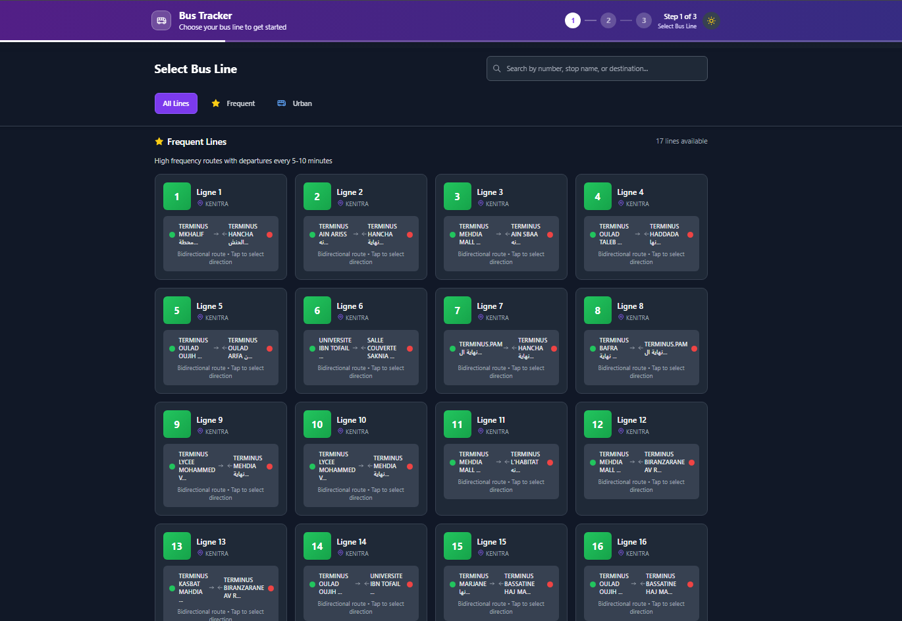
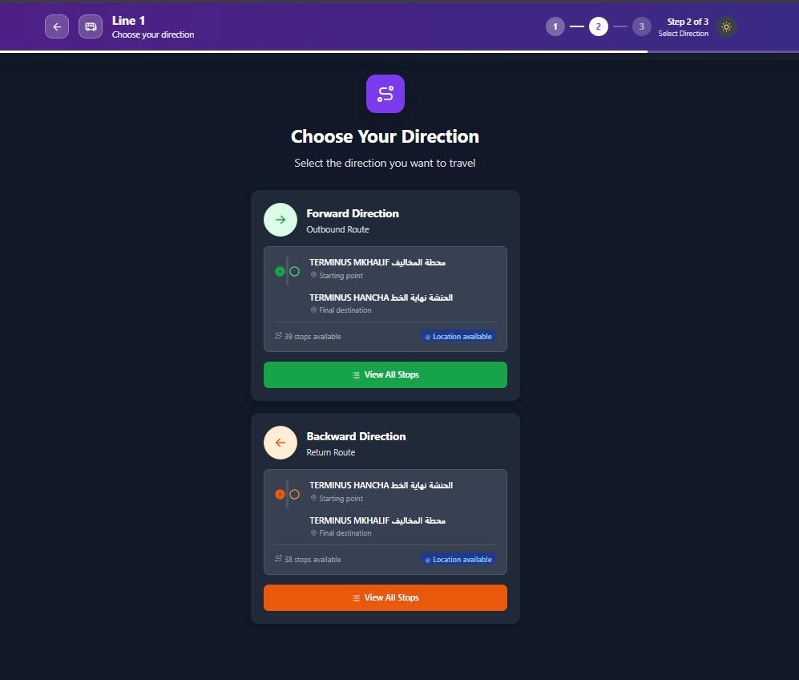
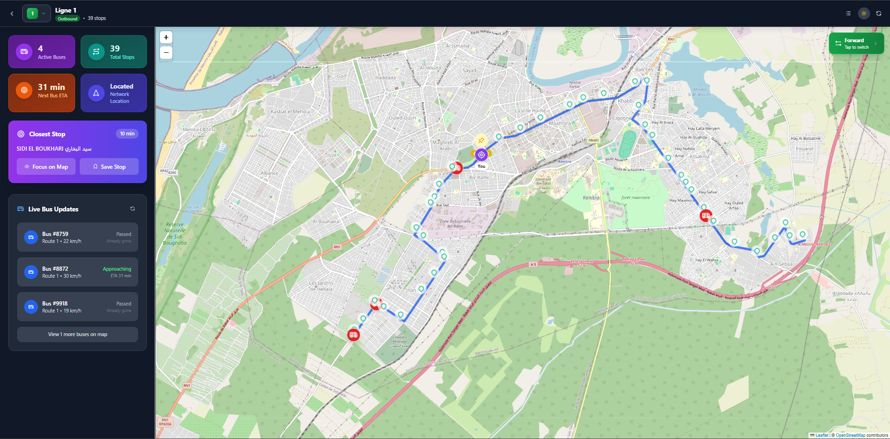

# 🚌 Vibuzz

Real-time Bus Tracking Web App That Get People Moving Faster Vibuzz is an intelligent real-time Bus tracking-web app that enable riders to move smoothly faster and comfortably on public transit. With an easy interface and real-time bus tracking with arrival estimates, Vibuzz makes it easy to know exactly where your bus is, when it’s going to arrive and how to best plan your ride whether you're going to work, going for a ride, or just navigating town!


## ✨ Features

- 🗺️ **Real-time Bus Tracking** - Live bus positions on interactive maps
- 📍 **Location-based Services** - Find closest bus stops using GPS
- 🚏 **Bus Stop Information** - Detailed stop information with ETAs
- 🔄 **Direction Selection** - Choose between forward and backward routes
- 🌙 **Dark/Light Theme** - Beautiful UI with theme switching
- 📱 **Responsive Design** - Optimized for both desktop and mobile
- 🎯 **Manual Location Selection** - Set location manually if GPS fails
- ⚡ **Fast Performance** - Built with Vite for optimal speed

## 🎯 How It Works

The app provides a seamless 3-step process to track your bus:

### Step 1: Select Your Bus Line
Choose from available bus lines in your city.

<div align="center">
  
</div>

### Step 2: Choose Direction
Select the direction you want to travel (Forward/Backward route).

<div align="center">
  
</div>

### Step 3: Track Your Bus
View real-time bus positions, nearby stops, and get live updates.

<div align="center">
  <h4>Desktop View</h4>
  
</div>

<div align="center">
  <h4>Mobile View</h4>
  
</div>

## 🚀 Getting Started

### Prerequisites

- Node.js (v18 or higher)
- npm or yarn package manager

### Installation

1. **Clone the repository**
   ```bash
   git clone https://github.com/aymanbest/vibuzz.git
   cd vibuzz
   ```

2. **Install dependencies**
   ```bash
   npm install
   ```

3. **Set up environment variables**
   Create a `.env` file in the root directory:
   ```env
   VITE_API_BASE_URL=your_api_base_url_here
   ```

4. **Start the development server**
   ```bash
   npm run dev
   ```

5. **Open your browser**
   Navigate to `http://localhost:5173`

## 🛠️ Built With

### Core Technologies
- **React 19.1.0** - Modern React with latest features
- **TypeScript 5.8.3** - Type-safe development
- **Vite 7.0.0** - Lightning-fast build tool
- **Tailwind CSS 3.4.0** - Utility-first CSS framework

### Key Libraries
- **React Router DOM** - Client-side routing
- **React Leaflet** - Interactive maps
- **Framer Motion** - Smooth animations
- **Tabler Icons** - Beautiful icon set

### Development Tools
- **ESLint** - Code linting
- **TypeScript ESLint** - TypeScript-specific linting
- **PostCSS & Autoprefixer** - CSS processing

## 📁 Project Structure

```
src/
├── components/          # Reusable UI components
│   ├── BusStopsList.tsx       # Bus stops list component
│   ├── BusTrackingView.tsx    # Main tracking view
│   ├── DirectionSelector.tsx  # Direction selection
│   ├── MapComponent.tsx       # Interactive map
│   ├── MobileBottomSheet.tsx  # Mobile interface
│   └── ...
├── contexts/           # React contexts
│   └── ThemeContext.tsx      # Theme management
├── hooks/              # Custom React hooks
│   ├── useApi.ts            # API data fetching
│   └── useLocation.ts       # Location services
├── styles/             # Styling utilities
│   └── designSystem.ts      # Design system
├── types.ts            # TypeScript type definitions
├── utils.ts            # Utility functions
└── App.tsx             # Main application component
```

## 🔧 Available Scripts

```bash
# Development
npm run dev          # Start development server

# Building
npm run build        # Build for production
npm run preview      # Preview production build

# Code Quality
npm run lint         # Run ESLint
```

## 🌟 Key Features Explained

### Real-time Bus Tracking
- Live bus positions updated in real-time
- Interactive map with custom markers
- Route visualization with stop sequences

### Smart Location Services
- GPS-based location detection
- Manual location selection fallback
- Closest stop calculation with walking distance

### Responsive Design
- Mobile-first approach
- Bottom sheet interface for mobile
- Sidebar interface for desktop
- Smooth animations and transitions

### Theme Support
- Dark and light mode support
- System preference detection
- Persistent theme selection

## 🔒 Environment Variables

| Variable | Description | Required |
|----------|-------------|----------|
| `VITE_API_BASE_URL` | Base URL for the bus tracking API | Yes |

## 🤝 Contributing

1. Fork the repository
2. Create your feature branch (`git checkout -b feature/AmazingFeature`)
3. Commit your changes (`git commit -m 'Add some AmazingFeature'`)
4. Push to the branch (`git push origin feature/AmazingFeature`)
5. Open a Pull Request

## 📝 License

This project is licensed under the MIT License - see the [LICENSE](LICENSE) file for details.

## 🙏 Acknowledgments

- **Leaflet** for the amazing mapping library

## 📞 Support

If you have any questions or run into issues, please open an issue on GitHub.

---
